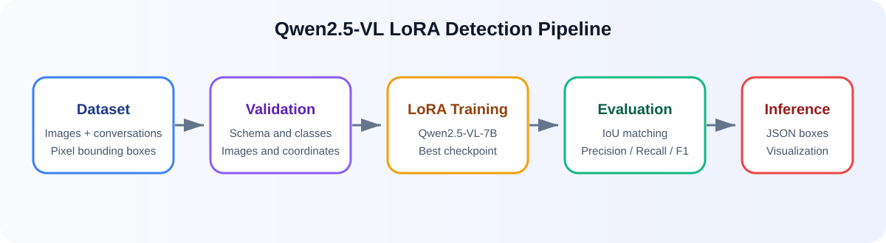
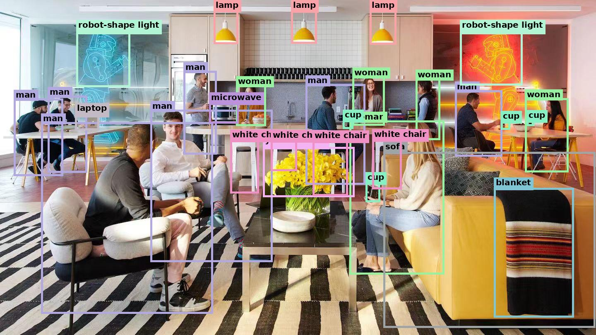

# Qwen2.5-VL-7B LoRA Object Detection

[简体中文](README.md) | [English](README_EN.md)

Fine-tune `Qwen/Qwen2.5-VL-7B-Instruct` with LoRA for custom object detection. The repository covers dataset validation, training, checkpoint recovery, best-checkpoint selection, test evaluation, prediction visualization, and single-image inference.

Class names are configured in JSON and are not hard-coded in Python.



## Visualization preview

`evaluate.py` produces detection visualizations with class labels and bounding boxes in the same general form as the image below. This image was found online and is included only as a visual reference. It is not an output produced by this repository on a public test set and does not represent the model's measured accuracy.



> Image source: online; original URL and license information still need to be added. Before publishing the repository, provide the original source and license, or replace this file with an image you have permission to redistribute.

## Features

- Qwen2.5-VL-7B-Instruct with PEFT LoRA
- Any number of custom classes
- Pixel-coordinate boxes in `[x1, y1, x2, y2]` format
- Loss applied only to assistant responses
- Best checkpoint selected by validation `eval_loss`
- Early stopping and automatic checkpoint recovery
- Per-class Precision, Recall and F1, plus Micro and Macro F1
- One-to-one IoU matching
- Side-by-side Ground Truth and Prediction visualizations
- Local Windows/Linux and Google Colab workflows

## Repository structure

```text
.
├── assets/
│   ├── detection_demo.svg
│   ├── example.jpg
│   └── workflow.svg
├── configs/
│   └── example.json
├── data/
│   ├── .gitkeep
│   └── example_train.json
├── outputs/
│   └── .gitkeep
├── scripts/
│   ├── common.py
│   ├── evaluate.py
│   ├── metrics.py
│   ├── predict.py
│   ├── train.py
│   └── validate_dataset.py
├── .gitignore
├── LICENSE
├── README.md
├── README_EN.md
└── requirements.txt
```

`train.py` contains training-specific dataset and collator code. `common.py` centralizes configuration, paths, random seeds, and inference model loading. `metrics.py` contains prediction parsing, IoU matching, metrics, and visualization utilities. The remaining files are focused command-line entry points.

## Requirements

- Python 3.10 or 3.11
- Windows or Linux
- NVIDIA GPU with CUDA support
- 24 GB or more VRAM recommended

If VRAM is limited, set `train_batch_size` to `1`, reduce `model_max_length`, and retain or increase `gradient_accumulation_steps`. BF16 is enabled by default. On a GPU without BF16 support, set `bf16` to `false` and `fp16` to `true`.

macOS can be used for editing configuration and validating data, but the current 7B training pipeline requires CUDA and cannot train on an Apple or Intel Mac GPU. Use a remote NVIDIA machine or a cloud GPU such as Google Colab.

## Installation with Anaconda

Install Anaconda or Miniconda, then clone the repository:

```bash
git clone https://github.com/LeonBytes/Qwen-LoRA.git
cd Qwen-LoRA
```

Create and activate an isolated environment in Anaconda Prompt, PowerShell, or a macOS/Linux terminal:

```bash
conda create -n qwen-detection python=3.10 -y
conda activate qwen-detection
python -m pip install --upgrade pip
pip install -r requirements.txt
```

Verify that PyTorch can access the NVIDIA GPU:

```bash
python -c "import torch; print(torch.cuda.is_available()); print(torch.cuda.get_device_name(0) if torch.cuda.is_available() else 'CUDA GPU not found')"
```

The first value must be `True` before training. The base model is downloaded from Hugging Face on first use. A local model directory can be supplied with `--model-path`.

## Dataset preparation

Create this structure:

```text
data/
├── train.json
├── validation.json
├── test.json
└── images/
    ├── train/
    ├── validation/
    └── test/
```

A split close to 80% training, 10% validation, and 10% test is a reasonable starting point. Near-duplicate images from the same source should not be distributed across different splits.

### Recommended image size

Process all training, validation, and test images to `1280 × 1280` before creating annotations. For non-square source images, preserve the original aspect ratio and add padding with a letterbox operation instead of stretching the image and distorting object shapes.

Bounding-box coordinates must correspond to the processed `1280 × 1280` images. If images are resized after annotation, every box must be converted or regenerated. Training, validation, test, and production inference should use the same preprocessing method. This repository does not automatically resize dataset images to `1280 × 1280`; prepare them before running validation or training.

Each annotation file is a JSON array. Every sample contains an image path and exactly two conversation messages:

```json
[
  {
    "image": "example_001.jpg",
    "conversations": [
      {
        "from": "human",
        "value": "<image>\nLocate all class_a and class_b objects in this image and output their bbox coordinates in JSON format."
      },
      {
        "from": "gpt",
        "value": "{\"class_a\":[[35,48,180,240],[225,60,390,275],[430,95,610,320]],\"class_b\":[[70,310,245,465],[330,345,560,510]]}"
      }
    ]
  }
]
```

The human message must start with `<image>\n`. The GPT value is a JSON string containing one list of boxes per class. Because it is nested inside the annotation JSON, its internal quotation marks are escaped. Coordinates must satisfy:

```text
0 <= x1 < x2 <= image width
0 <= y1 < y2 <= image height
```

Keep a class key with an empty list when that class is absent from an image.

## Configuration

Copy and edit the example configuration:

```bash
cp configs/example.json configs/my_dataset.json
```

Update `class_names` and `prompt`:

```json
{
  "class_names": ["class_a", "class_b"],
  "prompt": "Locate all class_a and class_b objects in this image and output their bbox coordinates in JSON format."
}
```

The configured class names, the keys inside every GPT response, and the classes named in training and inference prompts must agree.

## Validate the dataset

```bash
python scripts/validate_dataset.py \
  --config configs/my_dataset.json \
  --data-dir data
```

The validator checks message structure, nested JSON, class names, image existence, image readability, and bounding-box ranges. It exits with a non-zero status if any error is found.

## Training

```bash
python scripts/train.py \
  --config configs/my_dataset.json \
  --data-dir data \
  --output-dir outputs/my_experiment
```

The output directory contains full `checkpoint-*` directories and a `best_model` LoRA adapter selected by the lowest validation loss. The test set is never used for model selection.

Running the same command after an interruption automatically resumes from the latest full checkpoint. Use a new output directory for a new experiment. The maximum number of optimizer steps can be overridden with `--max-steps 500`.

Start TensorBoard with:

```bash
tensorboard --logdir outputs/my_experiment/logs
```

## Test evaluation

```bash
python scripts/evaluate.py \
  --config configs/my_dataset.json \
  --data-dir data \
  --output-dir outputs/my_experiment
```

Results are written to:

```text
outputs/my_experiment/test_evaluation/
├── evaluation_report.json
├── predictions.json
└── visualizations/
```

Evaluation uses one-to-one box matching within each class at the configured IoU threshold. These F1 metrics are fixed-IoU generative detection metrics and are not COCO mAP. Add `--skip-visualizations` if only numeric output is needed.

## Single-image inference

```bash
python scripts/predict.py path/to/image.jpg \
  --config configs/my_dataset.json \
  --output-dir outputs/my_experiment
```

To use another adapter or a local base model:

```bash
python scripts/predict.py path/to/image.jpg \
  --config configs/my_dataset.json \
  --adapter-path path/to/adapter \
  --model-path path/to/base-model
```

## Google Colab

Place the repository and dataset in Google Drive, mount the drive, and run:

```python
from google.colab import drive
drive.mount("/content/drive")
```

```bash
%cd /content/drive/MyDrive/qwen-lora-detection
!pip install -r requirements.txt
!python scripts/validate_dataset.py --config configs/my_dataset.json --data-dir data
!python scripts/train.py --config configs/my_dataset.json --data-dir data --output-dir outputs/my_experiment
!python scripts/evaluate.py --config configs/my_dataset.json --data-dir data --output-dir outputs/my_experiment
```

If Colab requests a runtime restart after installation, restart it, mount Drive again, and then run training.

## Troubleshooting

- CUDA out of memory: reduce `train_batch_size`, `model_max_length`, or image resolution.
- Invalid JSON output: keep training answers JSON-only and use the same prompt for training and inference.
- Out-of-range predictions: training annotations are validated; raw generated predictions are preserved for diagnosis while visualization coordinates are clipped.
- Changing classes: update the configuration and all annotation files, then train into a new output directory.

## License and model terms

The repository code is released under the MIT License. Model weights are not included. Users must comply with the Qwen model license and ensure they have permission to use and publish their datasets and annotations.
